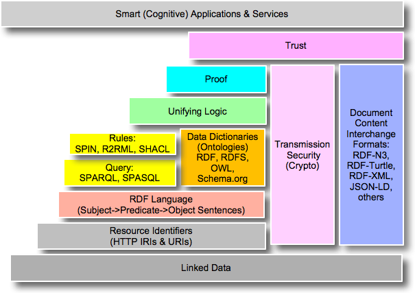

# Part 2

## Overall Guidance 
Target Audience: Developers, System Architects

Goal: Show how to implement semantic solutions and to achieve semantic interoperability

Give an overview of strengths when using semantic technologies.

Abstractions, hiding some aspects to make applications easier (but keeping key advantages).

Introduce existing tools, how they can be applied.

Point to relevant standard.

Show a small, but relevant example, e.g. cross-domain.

## Introduction
The Internet of Things (IoT) is expected to interconnect, at massive scale, numerous sensors, devices, gateways, and systems to tackle many challenges in the industry. Nowadays, the IoT deployments generates huge amount of information referring transport, environmental or traffic situation. However, an advancement in the generation of newer insights requires to combine information from different domains (fuse information), explore the generated information and derive events as a result of this combination. As a response to that need, one of the current trends is to interconnect those entities ("Things") around the different domains. Such inter-connectivity will play an essential part in designing industrial systems with added value services which are more energy efficient with lower costs while contributing to a better environment. These promises promoted by the emergence of the industrial Internet of Things have surged the importance of interoperability among the things to turn this vision into reality. Despite this importance of interconnecting Things, the industrial environment are living a stagnation in the capacity of making response to industry events (e.g detection of earthquakes, industrial machine errors, etc) due to the silos of knowledge generated by the deployment of those systems in specific domains. 

Designing IoT applications requires a shared understanding of the exchanged data among those connected things. Moreover, it is also necessary to deal with an hetereogeneus stack of standards and data exchange reference models. In order to minimise the impact of vendor locking caused by custom standards, there exist a movement of promoting open standarization models (e.g ETSI standards, etc). This trend have ensured syntactic interoperability between systems in terms of connecting systems and sharing inforamtion. However, the problem araises when IoT devices with different data exchange formats coexists. In this scenario, a semantic interoperability between system is necesary to link the inforamtion and make it understandable. Thus, semantic technology advances is the key point as one of the most promising fields in the knowledge representation domain. 

The World WideWeb Consortium (W3C) defines a set of standards , such as RDF/OWL, JSON-LD and SPARQL, to represent semantics and query linked data, offering an ideal ecosystem and opportunity to tackle the heterogeneity challenge in the IoT. In industrial environments and automation domains, semantic technology has been used to solve data/device interoperability issues and to provide context aware applications and services.

Despite its potential and promises, semantic technology and ontology-based IoT applications still remain in the hands of a minority, the ontology experts, being too difficult to be adopted and applied by industrial practitioners. We attribute such retention among other factors to the absence of adequate methodology and tools involving several major actors participating in the design life cycle of an IoT application, who are typically non-ontology experts.

## Problem
The W3C defined a semantic layer cake

[^1]: https://www.w3.org/2000/Talks/1206-xml2k-tbl/slide10-0.htm

based on a set of standards to develop the semantic web. The aim of these standards is to focus mainly on the knowledge representation to solve the data interchange problem in addition to several non functional requirements such as data validation, proof and trust.

According to the Semantic Web standards, data representation can be expressed in the following standards RDF, RDF-S, and OWL. More precisly, such descriptive languages allow to represent a model and its instantiation. Several ontologies exist publically to represent a domain model, for example: the Semantic Sensor Network Ontology/SOSA (https://www.w3.org/TR/vocab-ssn/) proposes a model to represent a sensor network, Fiesta-IoT/m3 ontology (http://ontology.fiesta-iot.eu/ontologyDocs/fiesta-iot/doc) establishes a methodology for linking IoT services and testbeds, Web of Things vocabulary (https://www.w3.org/TR/wot-thing-description/) to integrate and make interoperable diverse applications and Things and SAREF (Documentation:http://ontology.tno.nl/saref; URL:http://ontology.tno.nl/saref.ttl) proposes a model to represent smart appliances functionalities, expected behavior and how they interact with their environment and their locations. Other ontologies such as Brick (http://brickschema.org/structure/) focus on the Building Management System domain detailing a vocabulary of equipment types, their expected behviour in addition to their interactions with other equipments. 

Once an ontology model has been defined, the next step is to instantiate it. Instantiating an ontology implies producing data which conforms to the model. For example, an instantiation of a Brick ontology implies for a given site, the data produced by a Building Management System conforms to the Brick Model. **(need to give a simple example here based on a public ontology, maybe Brick is not so generic, to be discussed on the call)**

* http://www.cs.virginia.edu/~dh5gm/pdf/brick-journal.pdf
* https://www.google.com/url?sa=t&rct=j&q=&esrc=s&source=web&cd=8&cad=rja&uact=8&ved=0ahUKEwjG4_j-3onbAhUxb5oKHbj_BjUQFghCMAc&url=https%3A%2F%2Fbrickschema.org%2Fpapers%2FBrick_BuildSys_Presentation.pdf&usg=AOvVaw1igBB2grS0-9uMXD2_9kPW

Ontology instantiation process requires:
1. An ontology model.
2. A software enabler to produce or transform data according to the provided ontology model.
3. A software developer implementing the software enabler

Acceptance criteria:
1. Data produced conforms to the ontology model
2. Data produced is expressed in one of the W3C standards formats such as rdf/xml, json-ld, citations.

**Should we give an overview of the Software Developer persona?**
A Software Developer persona is a non ontology expert, non familiar with the Semantic Layer cake. She is given an ontology model expressed in OWL and is asked to develop an enabler which can be embedded in a system or on the cloud to produce (or transform) data conform to the model. The data produced need to be expressed in one of the W3C standard.

In the following, we depict the list of tools available to a software developer to achieve her goal and meet the acceptance criteria 

** Focus on Developer Experience: NON Ontology Expert **

## Existing Methods and Tools

### Ontology HTML Renderers
#### Ontology Documentation Tools
1. [Ontoology](http://ontoology.linkeddata.es/) with [detailed instructions](http://ontoology.linkeddata.es/stepbystep) on how to use it.

2. [LODE](https://github.com/essepuntato/LODE)

   LODE Web Service example: http://www.essepuntato.it/lode/http://purl.org/iot/ontology/fiesta-iot#

#### Ontology HTML data exploration tools

1. Exhibit 3.0: http://simile-widgets.org/exhibit3/
2. Rizhomik: http://rhizomik.net/html/rhizomer/
3. Other?

### Ontolgy Development Tools
1. Protégé

2. TopBraid Composer

3. Ontology Visualization with WebVOWL

   WebVOWL Web Service example:

   http://visualdataweb.de/webvowl/#iri=http://purl.org/iot/ontology/fiesta-iot#

4. NeOn Toolkit (http://neon-toolkit.org)

5. Other?

### Ontology Manipulation Libraries
1. OWL API (Java)
2. Apache Jena (Java) as a library
3. RDF4J (Java)
4. DotNetRDF (C#)
5. RDF Charm (Python)
6. json module (Python)
7. RDFLib (Python)
8. pySesame (Python)
9. RDFLib.js (Javascript)
10. SPARQL.js (Javascript)
11. jsonld.js (Javascript)
12. rdfstore-js (Javascript)

### Semantic Web Architectures & Semantic Stores

#### Semantic Web Architectures

1. Apache Jena (Java)
2. NGSI-LD (retrieve scopded and filtered information, entity meta model, also works in highly distributed and federated settings)
   - Overview presentation: https://docbox.etsi.org/ISG/CIM/Open/Introduction_NGSI-LD_20180413.pdf
   - ETSI Group Specification: http://www.etsi.org/deliver/etsi_gs/CIM/001_099/004/01.01.01_60/gs_CIM004v010101p.pdf 

#### Semantic/Graph stores (Triple/Quad stores)
1. Sesame (Java)
2. MongoDB (C++, Java and Python drivers)
3. Jena TDB
4. OpenLink Virtuoso
5. GraphDB (new OWLIM): https://ontotext.com/products/graphdb/
6. Oracle Spatial and Graph RDF Semantic Graph
7. Stardog: https://www.stardog.com
8. Mulgara: http://mulgara.org
9. Sesame RDF: https://bitbucket.org/account/user/openrdf/projects/PROJ

### Retrieving Semantic Information
1. SPARQL (expressive query language on general RDF data, but requires (logically) centralized information)

### Object Relational Mappers
1. RomanticWeb (C#)
2. TrinityRDF (C#)
3. Empire (Java)
4. [Pinto](https://github.com/stardog-union/pinto)
5. [Komma](https://github.com/komma/komma)
6. Ultrasrap^TM^-Capsenta: https://capsenta.com
7. Morph RDB: https://github.com/oeg-upm/morph-rdb
8. D2R: http://d2rq.org/d2r-server
9. Others?

### Code Generators
1. Protégé Plugin
2. Eclipse EMF
3. [OLGA](https://www.researchgate.net/publication/319650390_A_Model_Driven_Approach_Accelerating_Ontology-based_IoT_Applications_Development): Ontology Library Generator 

### Ontology Alignment APIs?

1. Alignment API: http://alignapi.gforge.inria.fr

2. LogMap

   LogMap Web Service: http://krrwebtools.cs.ox.ac.uk/logmap/

## What is missing ? (need to find a better title here)

PerfectO project - Ontology Improvement Tool integrating a set of tools mentionned previously (WebVOWL, LODE, LogMap, etc.):

Demo: http://perfectsemanticweb.appspot.com/?p=ontologyValidation
