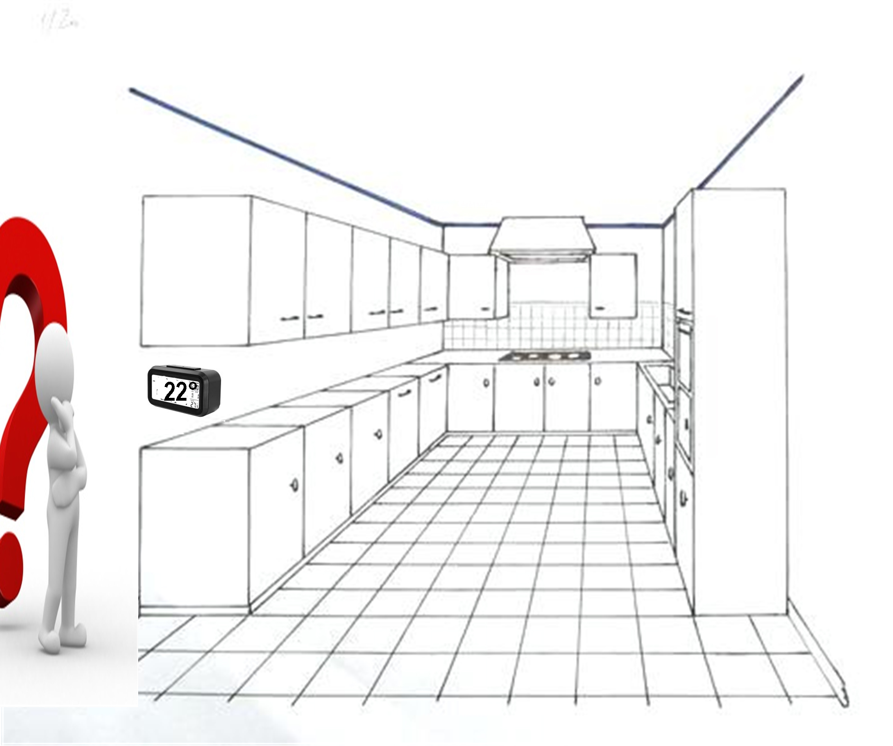
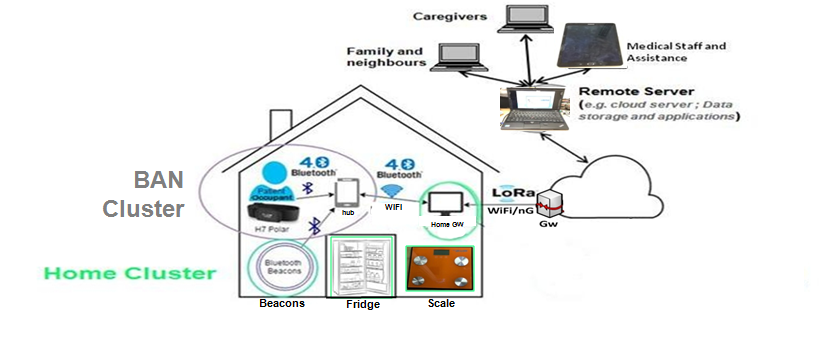
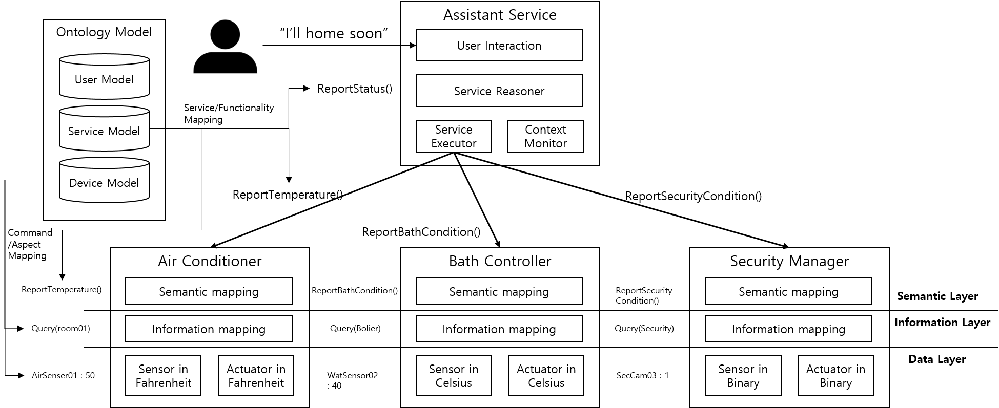

# Part 2

## Introduction [Martin Bauer]
Semantic technologies have recently gained significant support in a number of communities, in particular the IoT community. An important problem to be solved is that on the one hand it is clear that the value of IoT increases significantly with the availability of information from a wide variety of domains, on the other hand existing solutions target specific applications or application domains and there is no easy way of sharing information between the resulting silos. Thus a solution is needed to achieve interoperability between the silos. As there is a huge heterogeneity regarding IoT technologies on the lower levels, the semantic level is seen as a promising approach for achieving interoperability, i.e. semantic interoperability.
As a basis for this, semantic technologies have reached a good level of maturity and a number of standards and de-facto standards are available to implement semantic-based solutions. 
However, currently the widespread use is hindered by the fact that developers and system architects are not familiar with semantic technologies. The respective knowledge is still primarily limited to a group of experts. Thus, the purpose of this Whitepaper is to spread this knowledge further and in particular to show the developer community how semantic solutions can be implemented and how semantic interoperability can be achieved. The goal is to show the practical feasibility of the approach.
The approach of the paper is to take a small, but relevant example, and go through different aspects and activities that are needed when developing semantic solutions. For each of the steps relevant types of useful tools are explained with references to an appendix that provides a list of actual tools with short descriptions and relevant links, so, depending on the respective requirements, an appropriate tool can be chosen.

## Problem Description [Michelle Wetterwald, Marc Girod-Genet]

In this section, we describe the problem space in which semantics can be applied, in particular we explain why it is needed to provide platform, system or domain interoperability.

Several studies have demonstrated the fragmentation of the IoT eco-system in terms of standardization, available technologies and M2M service platforms. Accordingly, measurements and data available in one system or implementation are often not accessible by a different system. Furthermore, these systems and the data they handle are often still strongly dependent of the vertical domain in which they are implemented. 

Interoperability has been considered at various levels: technical (connectivity, network, syntactic), informational (semantic or business context) or even organizational. Technical levels cannot be easily achieved when addressing integrated platforms. The semantic or data level is thus the next level where interoperability can be envisioned. Furthermore, the different systems must share the same vocabulary and understand in an identical manner the information they exchange, while facilitating the design of service compositions. 

There is a need for a common model that describes a system and its components and can be understood by different implementations and platforms. It should provide a formalized specification of that system, including its main concepts, the relationship between its main components and their attributes. It should indicate the meaning of the data shared by a device, which can be understood by machines from different origins. Semantic interoperability enables interoperability at data level between platforms and IoT systems, but also between verticals domains. When an ontology is defined for one device from a vertical domain, e.g. agriculture, a generic interworking is made possible, i.e. the data it shares can be understood by machines and devices operating in other domains, for example smart mobility or smart city. It enables the IoT applications to make smarter decisions because they are able to collect, understand the meaning and process data from all sorts of devices. In that context, there is no further need to develop one-to-one interfaces and less risk to make errors when using external data.

Semantics and ontology definition can bring a valuable solution, as it defines a common and abstracted sub-layer above the services and platforms definition. Semantics interoperability thus enable the sharing of data across systems, avoiding the definition of a new common data model every time two different systems need to exchange information or the costly misinterpretation of data received from an external system.

As already aforementioned, one of the first interoperability level to take care of is at informational level, i.e. at data and semantic level. It is mandatory to address since it allows data heterogeneity management, both within a single platform and even across platforms (provided that the data model becomes a unified / standardized one). One good example of that is the Bluetooth LE GATT (Low Energy Generic Attributes) profile that has been standardized by the Bluetooth Special Interest Group (SIG) and enables interoperability of Bluetooth devices [https://www.bluetooth.com/specifications/gatt].



Figure 1: Simple example of a house room

Let us now take the simple problem of a house room with a black box on a wall (see figure 1), e.g. a sensor that is providing the following instant value: 22°. A visitor of the house has as much power of reasoning as humans do and is therefore guessing (due to the position of the black box, the value provided on the black Box screen  ̶  22°  ̶ , his central European location) that the provided value is a temperature expressed in degree Celsius. A machine (e.g. a Device, an automated process, an application…) for its part is not able to do a lot with this instant value (22°) since it does not know how to analyze this raw data, mainly:

 *	the meaning of the data, called metadata, e.g. in our home example a temperature measurement, with “Temperature” as name, ‘t’ as acronym, “°C” as unit of measure, “float” as measurement domain and 22 as value. With this metadata knowledge, few simple data analytics can already be performed, like e.g. in our home example, verifying if a  Temperature ‘t’ is not higher than 26,

 * and the context of the data, extending the metadata and called ontology, like e.g. in our home example, the information of the sensor that provides the data, the associated positioning and geo-localization, environment, room and home ID, home owner information. With that extended semantic knowledge, more powerful semantic data analytics can now be performed, like e.g. in our home example, which are the collocated houses that have the same Temperature value. 

Ontology design (i.e. specification, formalization) and implementation are thus mandatory for data heterogeneity management and semantic interoperability. It facilitates data/information sharing across systems and enables semantic-based embedded data analytics (e.g. for automated alarm management or control operations). If the ontology incorporates common upper level semantics, like e.g. service definition, then it enables data sharing at application level and also facilitates cross-domain use cases handling.

The specification of a semantic data model corresponds to the definition of concepts that characterize the data and its environment, associated with the links between those concepts. This is generally materialized through a diagram/graph where the concepts correspond to classes or tree nodes, and relations correspond to tree edges labelled by the relation type. For the simple example depicted in Figure 1, the black box on the wall is e.g. a device (this is a first concept) that makes a measurement (this is a second concept, linked to the first one by the relation ‘makes’). Concerning the formalization of the data model, this corresponds to the transcription of its corresponding concepts and their relations within a formalized description language. This computing description language insures in particular that the data model is readable and interpretable by both machines (e.g. Devices, automated processes, applications…) and humans in a unique and unambiguous way.

Next sections show, using a specific use case, how semantic interoperability can be implemented and deployed.

## Example Use Case [Laura Daniele, Marc Girod-Genet, Martin Bauer]
*Describe an example use case that instantiates the problem space, is as simple as possible, but shows the advantages of semantics and can be used in the following subsections.*

In this use case a smart home with smart devices is to be connected to the smart grid. The smart home resident wants to optimize the energy consumption of the house, but still be in control of key aspects, e.g. when the washing has to be done, when the batteries of the electronic vehicle have to be recharged, and that the temperature in the house is kept within a certain range etc. The smart grid company offers the smart home resident a special tariff with significant discounts during times when a surplus of energy is available in exchange for some control on the energy consumption. Thus the smart grid company gets means to balance the overall energy consumption and the smart home resident lowers the energy bill without a significant loss of convenience.

In order to implement the scenario, different systems have to be integrated allowing the following:
 * connect controllable user devices in the smart home
 * connect the smart grid with the smart home
 * provide the smart home resident with means to define operation policies for the devices
 * provide the smart grid operator with means to define time-dependent energy costs and request an energy-consumption profile
 * optimize energy consumption based on the time-dependent energy costs and the energy-consumption profiles in line with the operation policies and a possible consumption limit

To achieve interoperability between the systems, agreement on the interfaces and the modelling of information is necessary. In this paper we will show how the relevant information can be modelled on a semantic level to achieve semantic interoperability. 

Examples of what needs to be modelled:
 * Device 
   * status
   * control
   * monitoring
   * energy consumption profile
   * operation policy
 * Estimated energy cost timeline
 * Energy consumption limit

Customers can offer flexibility to the Smart Grid to manage their smart home devices by means of a Customer Energy Manager (CEM), a logical component that controls and optimizes the energy consumption in a smart home. The CEM is a logical function for optimizing energy consumption and/or production that can reside either in the home gateway or in the cloud. The component that collects and analyzes energy consumption is a smart meter. Example use cases that require interoperability and involve devices in the smart home, the CEM, smart meters and the smart grid are the following:
- configuration of devices that want to connect to each other in the home network, for example, to register a new dishwasher to the list of devices managed by the CEM;
- (re-)scheduling of appliances in certain modes and preferred times using power profiles to optimize energy efficiency and accommodate the customer's preferences;
- monitoring and control of the start and status of the appliances; 
- reaction to special requests from the Smart Grid, e.g. incentives to consume more or less depending on current energy availability, or emergency situations that require temporary reduction of power consumption. 

These use cases are associated with the user stories described in IEC TR 62746-2 [i.6], which include, among others, the following examples:
 *	User wants to do basic settings of his/her devices.
 *	User wants to know when the washing machine has finished working.
 *	User wants their washing done by 5:00 p.m. with the lowest electrical power cost.
 *	User likes to limit his own energy consumption up to a defined limit.
 *	User allows the CEM to reduce the energy consumption of the freezer in a defined range for a specific time, if the grid recognizes (severe) stability issues.
*	Grid related emergency situations (e.g. blackout prevention).

Let us now consider the additional case where the resident of the house is an elderly that needs support at home, as well as to be continuously monitored (i.e. wellbeing for aging well). In order to implement such use case:
  1.	the resident/elderly needs to be provided with a smart BAN (Body Area Network) for the monitoring and control of its vital    signs, status and activities. This smart BAN mainly comprises, in respect of its resident/elderly embedded device part (smart BAN Cluster), medical/wellbeing sensors, wearables, a BAN coordinator or hub (e.g. a smart-phone, a smart-watch) with in particular data concentrator and network gateway roles. The data concentrator is used for data collection and has also to be provided with embedded data analytics functionalities for local alarm management, local monitoring/control and resident/elderly assistance purposes. The network Gateway is mainly used for data sending to the remote monitoring/control servers and applications located within caregivers or relatives premises. Let us note that, for security/safety reasons, actuations on resident/elderly BAN devices have not been actually considered. 
  2.	this smart BAN has to interact with the Smart Home and some of its appliances mainly for the following purposes: resident/elderly positioning inside the house (e.g. through beacons on the walls), resident/elderly activity tracking, verification of interactions with key appliances (e.g. with a scale for weight measurement, or for verifying if fridge or cooker was used, or if a medication box was opened), resident/elderly comfort management (e.g. maintaining a given temperature/humidity/luminosity level in accordance with resident/elderly condition requirements, as well as with energy efficiency objectives that could be already parameterized for the Smart Home).

The additional use case (i.e. elderly at home monitoring and support) high level architecture is depicted in Figure 1.



In a such environment and use case, it is first mandatory to address security and privacy by design since we are dealing with eHealth and personal safety highly critical data and applications (even if actuations within BANs are not yet considered for quite all the existing use cases). It is also mandatory to address interoperability, in particular since:
1.	At least heterogeneity of medical devices and measures has to be masked at application level,
2.	At the operational level and from the hospital management information system (MIS) point of view, a new patient’ BAN integration into existing monitoring and control systems has to be carried out as far as possible without any redesign of those systems, even partially,
3.	At smart BAN level and from the end user perspective, any new sensor integration has to be transparent for the elderly, with a minimum number of easy operations.

For addressing all the aforementioned requirements, interoperability will have thus to be handled at multiple levels for our elderly at home additional use case:

 *	Device level for in particular handling point 3 and to some extend point 2,

 *	Informational level, i.e. data and semantic, for in particular

 - handling point 1, point 2, point 3,
 - data/information sharing across systems, i.e. Smart BAN and Smart Home systems,
 - enabling semantic-based embedded data analytics. This will be used here for alarm management, monitoring/control and resident/elderly/caregivers assistance purposes,
 - for facilitating cross-domain interactions, in particular between healthcare, wearables and Smart Home.

 * Network level for mainly handling point 2 and intra/inter systems interoperability.

## Ontology Selection / Creation [Amelie Gyrard, Iker Esnaola, Izaskun Fernandez]
This section aims to help developers willing to develop, integrate, select, and reuse ontologies. We recommend some guidelines for ontology development by defining a set of competency questions. Then, we strongly encourage to reuse existing ontologies by providing advices how to discover and select the appropriate existing ontologies fitting deverloper's needs. Some use cases are provided to help understanding.

Ontology Selection/Creation diagram:


### Identify ontology requirements

First of all, it is necessary to think about the objectives of the ontology. For that purpose, filling an ORSD (Ontology Requirements Specification Document) may be helpful. It facilitates identifying why the ontology is being built, what its intended uses are, who the end users are, and which requirements the ontology should fulfill.

- ORSD guide: http://oa.upm.es/5474/1/INVE_MEM_2009_64393.pdf

##### Use case ontology requirements
This is an excerpt of the OSRD created for the use case:


### Reuse existing ontologies

Once the objectives of the ontology are clear, it is necessary to actually have an ontology that fulfills those objectives. Instead of creating an ontology from scratch, it is a good practice to reuse existing ontologies when possible due to the following reasons [2]:

- The sharing and reuse of ontologies increase the quality of the applications using them, as these applications become interoperable and are provided with a deeper, machine-processable and commonly agreed-upon understanding of the underlying domain of interest.
- It reduces the costs related to ontology development because it avoids the reimplementation of ontological components, which are already available on the Web and can be directly – or after some additional customization – integrated into a target ontology.
- It potentially improves the quality of the reused ontologies, as these are continuously revised and evaluated by various parties through reuse.

According to [2], ontology reuse can be understood as a three-step process: (i) ontology discovery, (ii) ontology selection, and (iii) ontology integration.

#### (i) Ontology discovery 

It consists in finding appropriate ontologies that meet our requirements. This task can nowadays be facilitated due to the numerous ontology catalogs to find existing ontologies. Some of them, extensive analysis of ontology catalogs for smart cities can be found in [9]:
 
- Linked Open Vocabularies for Internet of Things (LOV4IoT) references more than 440 ontology-based projects relevant for IoT. It covers more than 20 domains: IoT, Wireless Sensor Networks (WSNs), Web of Things (WoT), smart home, smart energy, healthcare, smart city, robotics, etc. LOV4IoT is highly maintained and references more and more ontology-based projects and new domains are covered.
   
- OpenSensingCity, an ontology catalog for smart cities. This catalog might be not maintained anymore after the end of the project (ANR french project).
  
- Ready4SmartCities, an ontology catalog for smart cities. It seems it is not maintained anymore. 

- Linked Open Vocabularies (LOV) designed by the Semantic Web community. This catalog is highly maintained and references ontology fitting their best practices criteria (e.g., ontology metadata).

TO DO?:
We can reuse well-written paragraphs about ontology catalogs from this paper (third revision ongoing) if needed: Building IoT based applications for Smart Cities: How can ontology catalogs help? [Gyrard et al. IEEE IoT Journal 2017] (Impact Factor 7.5)

##### Use case ontology discovery

Since the use case presented in this report is more oriented to smart homes rather than smart cities, two of the aforementioned repositories (namely OpenSensingCity and Ready4SmartCities) have been dismissed for this task.

In the following Figure, a screenshot of LOV4IoT is shown. With regards to the “Smart Home, Smart office, Building Automation, Activities of Daily Living Catalog” to which the presented use case belongs to, SAREF is one of the top recommended ontology: shared online, referenced by the LOV community since it follows a set of best practices requested by the community, and highly maintained.


As for the LOV, the following Figure shows ontologies related to the term “electric consumption” which is relevant for the use case at hand as it has been shown in the OSRD.


#### (ii) Selection of suitable (parts of) ontologies

This task deals with assessing the usability of an ontology with respect to the use case requirements. This may end up being an arduous task due to the different criteria that may make ontologies suitable for a certain use case [3]. These criteria encompass the content of the ontology and the organization of their contents, the language in which is implemented, the methodology that has been followed to develop it, the software tools used to build and edit the ontology, and the costs that the ontology will be necessary in a certain project Furthermore, the scarce documentation of ontologies may difficult even more this process.

In order to ease this selection phase, we recommend to look first at ontologies supported by standardization activities (e.g., W3C SOSA, SAREF, W3C WoT, oneM2M, SmartBAN, etc.).

In case the developer needs to reuse only a subset of classes and properties of the ontology, instead of the whole ontology, an extractor tool (see Appendix section) can be used.

Limitations: Indeed, we would need some ontology ranking algorithms to help better developers find suitable ontologies for their needs.

As an illustration, in the context of our room and temperature sensor simple example already introduced in Figure 1 (see problem description section), we are in a Smart Home application domain. In such vertical, the reference ontology that meets the use case description is SAREF. Therefore, by using parts of SAREF ontology, our temperature sensor can be viewed as a Device (saref:Device):
- With saref:Sensor as device category,
- That is provided with e.g. a Description (String), a Manufacturer (String), a model (String), a State (e.g. on or off) as properties,
- That offers/performs sensing expressed as saref:Function, with saref:SensingFunction (which has a range, a sensing time and the sensor type  ̶  ‘Temperature’ in our example  ̶  as properties) as category, saref:GetCommand as command (i.e. GetTemperature in our example), 
- and that is used for sensing a temperature of type saref:Temperature. This ‘Temperature’ property (a saref:Property) has a unit of measure of the type saref:UnitOfMeasure (°C in our example), and has a Value (22 in our example).

This can finally be modeled through the UML diagram presented in Figure below.


##### Use case ontology selection
After having identified the ontologies that may be suitable for the use case at hand, it has to be decided which ontologies to reuse as they are. For the use case at hand, the reuse of SAREF as it is may be a good decision, due to its support by a standardization body. However, SAREF does not cover all the use case requirements, so other ontologies need to be reused.

If ontologies covering the same domains are imported altogether, they may overlap to a greater or lesser extent in some of their parts. Therefore, in these cases parts of ontologies can be reused to avoid redundancy issues and enhance interoperability. The m3-lite ontology contains covers terms related to “properties” that are not exhaustively captured in SAREF. However, the coverage of the m3-lite is wider than needed, so we only need the subclasses of qu:QuantityKind. For that purpose, the Module Extractor Tool (see Appendix).


After executing it, we get an ontology module named “m3-lite_QuantityKindModule” that contains all the subclasses of class qu:QuantityKind plus the other necessary axioms for the given concepts. Comparing this module with the original m3-lite ontology, we can see how the size has been reduced, including only the terms that are related to our use case (in this case, the properties). The number of axioms have been reduced from 2035 to 360, and the number of classes from 451 to 178.


#### (iii) Ontology integration 
Finally, the selected ontology or ontologies may need to be customized in order to adapt them and satisfy the use case’s requirements. This customization may involve additional modification and integration operations such as extraction of ontology parts or even content and structural modification or extension.

When more than one ontology (or parts) are integrated, ontology matching tool can be performed to return a potential alignment between two ontologies. Some basic ontology matching tasks consist in setting relationships such as:
- Equivalences between concepts (with the owl:equivalentClass property)
- Subsumptions (with the rdfs:subClassOf or rdfs:subPropertyOf properties)
- Disjointness between entities (with the owl:DisjointOf property)
- Labels an comments to deduce similarities (with rdfs:label and rdfs:comment properties)

##### Use case ontology integration

After having both the SAREF ontology and the “m3-lite_QuantityKindModule” module, we need to integrate them. The process to be followed towards this goal will depend on the ontology design tool used. Once integrated, it needs to make explicit that the class saref:Property and qu:QuantityKind have the same adjacent semantics. That is, the equivalence between the two concepts needs to be set. This equivalence can be set with the following axiom:

saref:Property owl:equivalentClass qu:QuantityKind

Likewise, the equivalence can be set in the ontology design tool.


### Create new ontology / Extend existing ontologies

If the existing ontologies do not meet all the requirements captured in the OSRD, ontologies need to be extended and maintained. 

In case no existing ontologies have been found for our specific requirements captured in the OSRD, there might be a need to develop your own ontology. 

For a more exhaustive ontology creation guide, we advice excellent documentation and methodologies: the NeOn methodology for ontology engineering[1], and the ontology development 101 [5]).

Protégé [6] is one of the most popular software to learn how to create ontologies. Protégé provides a Graphical User Interface (GUI) to design and develop ontologies. You can either set up Protege on your computer or use the web collaborative Protege tool. We provide a set of excellent tutorials to develop your first ontology with Protégé (see Appendix Section.

When creating or extending an ontology, it is advisable to follow the modularisation principle by separating the required knowledge in well-decoupled ontology modules. The main benefits of this principle are: 1) scalability for querying data and reasoning on ontologies, 2) scalability for evolution and maintenance, 3) complexity management, 4) understandability, 5) context-awareness and personalization, and 5) reuse [4]. For example, when some of the ontology modules are updated, thanks to the modularization, the impact of these changes in other modules and the global ontology is minimized. IoT-O [7] and [8] FIESTA-IoT ontologies are good examples of ontology modules.

Note that the extension and maintenance of ontologies require proper understanding on the resulting business impact. For instance a smart appliance using an extended ontology might no longer be interoperable with another smart appliance using the initial version. A maintenance strategy might have therefore to be defined prior to the implementation of an extension.

It is also recommendable to use Ontology Design Patterns (ODP) (see Appendix Section) as building blocks to create new ontology modules. An ODP is a modeling solution to solve a recurrent ontology design problem. The ODP repository collects and makes ODPs available on the web. It may contain a solution created by somebody else who already faced the same modeling challenge.

Once the ontology is created, it is advisable to align it with related ontologies and upper-level ontologies (i.e. DUL) to make the ontology applicable to similar problems in different domains and scenarios.

TO DO? should we provide more examples protege with smart home ontology? How to create a concept, and property relevant for smart home (show protege interface, and code)?

TO DO? Check and merge with ontology development section (Part2.md)?

### Ontology Selection
Most of the time you already have some keywords and key phrases in mind to build the system or application. For the smart domain, keywords are “room temperature” “actuators”, “humidity”, those keywords can be mapped to concepts within ontologies.
Ontology catalogs can provide such browsing functionalities with specific keywords.

### Application of Ontology Selection to Use Case

*The use case needs integration and control of smart devices at home and the connection to the smart grid which happens to be supported by the standardized ontology SAREF and its smart energy extension SAREF4ENER. The selection of these ontologies - ideally as opposed to some other non-standard options - should be described in this section. The following paragraph was originally part of the use case section, but the selection of ontologies should not already be discussed there.*

*The demonstrator produced during the recent DSF study for interoperability for the European Commission (SMART 2016/0082) in close collaboration with industrial stakeholders and appliance manufactures implements an energy gateway that uses SAREF and SAREF4ENER as overarching ontologies to combine data represented by oneM2M resources on the smart grid side (based on e.g., the IEC 61970 CIM standard), with data represented by SPINE resources on the Smart Home side (based on the CENELEC EN 50631-1 standard), and data represented by COSEM objects/ OBIS codes on the smart meter side (based on the IEC/CENELEC 62056 COSEM standard).* 

Requirements and competency questions for the energy efficiency use case:
The main requirement is to establish a common terminology to be shared by devices from different manufacturers and using different protocols to express the concept of power profile and its related concepts. The main competency questions are: What is a power profile? What is an alternatives group? What is a power sequence? What is a slot? These questions are supported by the following statements:
- A power profile is a way to model curves of power and energy over time, which also provides definitions for the modelling of power scheduling including alternative plans. With a power profile, a device (or power sequences server) exposes the power sequences that are potentially relevant for the CEM (or power sequences client).
- An alternatives group is a collection of power sequences for a certain power profile.
- A power sequence is the specification of a task, such as wash or tumble dry, according to user preferences and/or manufacturer's settings for a certain device. It is the most 'coarse' view; a power sequence can represent all single steps of a whole task, where the single steps are represented by slots.
- A slot is a single step of a power sequence. A slot is associated with a slot number (while a power sequence is associated with a power sequence identifier). The slot numbers of two power sequences should be considered independent from each other, i.e. slot number 7 of sequence 1 describes a different slot than slot number 7 of sequence 2. Therefore, a slot is only uniquely identified in combination with a sequence ID. 

### References

[1] Suárez-Figueroa, Mari Carmen, Asunción Gómez-Pérez, and Mariano Fernández-López. "The NeOn methodology for ontology engineering." Ontology engineering in a networked world. Springer, Berlin, Heidelberg, 2012. 9-34.

[2] Elena Simperl. 2009. Reusing ontologies on the SemanticWeb: A feasibility study. Data & Knowledge Engineering 68, 10 (2009), 905–925.

[3] Adolfo Lozano-Tello and Asunción Gómez-Pérez. 2004. Ontometric: A method to choose the appropriate ontology. Journal of database management 2, 15 (2004), 1–18.

[4] Heiner Stuckenschmidt, Christine Parent, and Stefano Spaccapietra. 2009. Modular ontologies: concepts, theories and techniques for knowledge modularization. Vol. 5445. Springer.

[5] NF Noy, DL McGuinness. Ontology development 101: A guide to creating your first ontology (2011). Stanford knowledge systems laboratory technical report KSL-01-05

[6] Protégé tool: https://protege.stanford.edu/

[7] Seydoux et al. IoT-O, a Core-Domain IoT Ontology to Represent Connected Devices Networks (EKAW 2016)

[8] Agarwal et al. Unified IoT ontology to enable interoperability and federation of testbeds (WF-IoT 2016)

[9] Gyrard et al. Building IoT based applications for Smart Cities: How can ontology catalogs help? (IEEE IoT Journal 2017) 


### Appendix for this section

A set of pointers to develop your first ontology:
- Protégé Tutorial [Horridge et al. 2011] – Design the Pizza ontology. Check if there is a more recent documentation. Documentation: http://mowl-power.cs.man.ac.uk/protegeowltutorial/resources/ProtegeOWLTutorialP4_v1_3.pdf
- 101 Ontology Development methodology [Noy et al. 2001] - Learn with the wine ontology and discover ontology best practices. Documentation: https://protege.stanford.edu/publications/ontology_development/ontology101.pdf

Ontology discovery: 
- LOV tool: http://lov.okfn.org/dataset/lov/
- LOV4IoT tool: http://lov4iot.appspot.com/?p=ontologies
- OpenSensingCity tool: http://ci.emse.fr/opensensingcity/ns/ontologies/
- Ready4SmartCities tool: http://smartcity.linkeddata.es/
 
Ontology Design Patterns (ODP) repository:
- http://www.ontologydesignpatterns.org 

Locality Module Extractor tool: 
- https://www.cs.ox.ac.uk/isg/tools/ModuleExtractor/ 

## Ontology Instantiation [Charbel Kaed]
Given an ontology, how can this ontology be instantiated for a concrete use case.

Example of ontology instantiation for the use case on energy efficiency. 

It shows an example of how to instantiate a power profile using the SAREF4ENER extension of SAREF. This power profile is used by an heating system with hot water tank to communicate its energy flexibility to the CEM according to the consumer's preferences and needs. The corresponding Turtle code is provided below. A distinction between SAREF and SAREF4EE is made using the prefixes saref: and s4ener:, respectively.

A s4ener:PowerProfile inherits the properties of the more general saref:Profile, extending it with additional properties that are specific for SAREF4ENER. The s4ener:PowerProfile is used by a s4ener:Device to expose the power sequences that are potentially relevant for the CEM, for example, a heating system with hot water tank that wants to communicate its expected energy consumption for a certain day (s4ener:HeatingSystem instance). The s4ener:HeatingSystem exposes a s4ener:PowerProfile (s4ener:PowerProfile-1-HS0001 instance), which consists of two groups with alternative plans (each group is modelled as a s4ener:AlternativesGroup class). These groups do not overlap in time and allow to model consecutive (and also rather independent) periods of action. For example, the s4ener:PowerProfile-1-HS0001 contains one group of alternatives for a task in the morning, and another group of alternatives for another (additional) task in the afternoon. Within one group, there can be one or more plans represented by s4ener:PowerSequence classes (i.e. s4ener:AlternativesGroup-1-HS0001 and s4ener:AlternativesGroup-2-HS0001) which are alternatives to each other (i.e. at most one of these plans can be finally executed). For example, to charge the hot water tank, the heating system mentioned above can offer within the "afternoon alternative group" two alternative plans, represented as power sequences: (a) a "cheapest" plan in which the CEM should try to minimize the user's energy bill, and (b) a "greenest" plan in which the CEM should try to optimize the configuration towards the maximum availability of renewable energy. 

Therefore, in the afternoon group (s4ener:AlternativesGroup-2-HS0001) the heating system offers two different power sequences: (a) s4ener:PowerSequence-3-HS0001 that aims to run "as cheap as possible" and permits the CEM to shift the start between 8:45 and 12:00, and (b) s4ener:PowerSequence-2-HS0001 that aims to reduce energy (it can even announce the user's preference for "green energy"). This means for the afternoon the CEM can take a choice for the "cheap" or the "green" plan. The plans may have further options with regards to their flexibility. For example one of the plans may offer that the CEM can pause a sequence (as long as the sequence completes before the latest time set by the user). Finally, a s4ener:PowerSequence consists of one or more slots (s4ener:Slot class) that represent different phases of consumption (or production) and their values. The power sequences of the heating system example have a single slot each. However, for other devices such as washing machines, a power sequence may have various slots for the different phases of washing, such as heating the water, washing and rinsing.

RDF code for SAREF4ENER example

&#35; baseURI: http://ontology.tno.nl/examples/saref4ener/heatingsystem

&#35; imports: https://w3id.org/saref4ener

@prefix heatingsystem: <http://ontology.tno.nl/examples/saref4ener/heatingsystem#> .
@prefix owl: <http://www.w3.org/2002/07/owl#> .
@prefix rdf: <http://www.w3.org/1999/02/22-rdf-syntax-ns#> .
@prefix rdfs: <http://www.w3.org/2000/01/rdf-schema#> .
@prefix s4ener: <https://w3id.org/saref4ener#> .
@prefix saref: <https://w3id.org/saref#> .
@prefix time: <http://www.w3.org/2006/time#> .
@prefix xsd: <http://www.w3.org/2001/XMLSchema#> .

<http://ontology.tno.nl/examples/saref4ener/heatingsystem>
  rdf:type owl:Ontology ;
  owl:imports <https://w3id.org/saref4ener> ;
  .
time:Beginning_PowerProfile-1-HS0001
  rdf:type time:Instant ;
  rdfs:label "Beginning Power profile-1-HS0001"^^xsd:string ;
  time:inXSDDateTime "2016-12-15T00:01:01.01"^^xsd:dateTime ;
.
time:Beginning_PowerSequence-HS0001_afternoon
  rdf:type time:Instant ;
  rdfs:label "Beginning Power sequence-HS0001 afternoon"^^xsd:string ;
  time:inXSDDateTime "2016-12-15T15:30:00.00"^^xsd:dateTime ;
.
time:Beginning_PowerSequence-HS0001_morning
  rdf:type time:Instant ;
  rdfs:label "Beginning Power sequence-HS0001 morning"^^xsd:string ;
  time:inXSDDateTime "2016-12-15T08:45:00.00"^^xsd:dateTime ;
.
time:DateTimeInterval_PowerProfile-1-HS0001
  rdf:type time:DateTimeInterval ;
  rdfs:label "Date time interval Power profile-1-HS0001"^^xsd:string ;
  time:hasBeginning time:Beginning_PowerProfile-1-HS0001 ;
  time:hasEnd time:End_PowerProfile-1-HS0001 ;
.
time:End_PowerProfile-1-HS0001
  rdf:type time:Instant ;
  rdfs:label "End Power profile-1-HS0001"^^xsd:string ;
  time:inXSDDateTime "2016-12-15T00:23:59.59"^^xsd:dateTime ;
.
time:End_PowerSequence-HS0001_afternoon
  rdf:type time:Instant ;
  rdfs:label "End Power sequence-HS0001 afternoon"^^xsd:string ;
  time:inXSDDateTime "2016-12-15T00:18:00.00"^^xsd:dateTime ;
.
time:End_PowerSequence-HS0001_morning
  rdf:type time:Instant ;
  rdfs:label "End Power sequence-HS0001 morning"^^xsd:string ;
  time:inXSDDateTime "2016-12-15T00:12:00.00"^^xsd:dateTime ;
.
time:PowerSequence-HS0001_afternoon
  rdf:type time:DateTimeInterval ;
  rdfs:label "Power sequence-HS0001 afternoon"^^xsd:string ;
  time:hasBeginning time:Beginning_PowerSequence-HS0001_afternoon ;
  time:hasEnd time:End_PowerSequence-HS0001_afternoon ;
.
time:PowerSequence-HS0001_morning
  rdf:type time:DateTimeInterval ;
  rdfs:label "Power sequence-HS0001 morning"^^xsd:string ;
  time:hasBeginning time:Beginning_PowerSequence-HS0001_morning ;
  time:hasEnd time:End_PowerSequence-HS0001_morning ;
.
s4ener:AlternativesGroup-1-HS0001
  rdf:type s4ener:AlternativesGroup ;
  rdfs:label "Alternatives group-1-HS0001"^^xsd:string ;
  saref:consistsOf s4ener:PowerSequence-1-HS0001 ;
  s4ener:alternativesGroupID 1 ;
  s4ener:belongsTo s4ener:PowerProfile-1-HS0001 ;
.
s4ener:AlternativesGroup-2-HS0001
  rdf:type s4ener:AlternativesGroup ;
  rdfs:label "Alternatives group-2-HS0001"^^xsd:string ;
  saref:consistsOf s4ener:PowerSequence-2-HS0001 ;
  saref:consistsOf s4ener:PowerSequence-3-HS0001 ;
  s4ener:alternativesGroupID 2 ;
  s4ener:belongsTo s4ener:PowerProfile-1-HS0001 ;
.
s4ener:EndTimeDurationDescription_PS-1-HS0001
  rdf:type s4ener:EndTimeDurationDescription ;
  rdfs:label "End time duration description PS-1-HS0001"^^xsd:string ;
.
s4ener:EndTime_PS-1-HS0001
  rdf:type s4ener:EndTime ;
  rdfs:label "End time PS-1-HS0001"^^xsd:string ;
.
s4ener:Energy_1
  rdf:type s4ener:Energy ;
  rdfs:label "Energy 1"^^xsd:string ;
  saref:isMeasuredByDevice s4ener:HeatingSystem ;
.
s4ener:Heating
  rdf:type saref:Task ;
  rdfs:label "Heating"^^xsd:string ;
.
s4ener:HeatingSystem
  rdf:type s4ener:Device ;
  rdfs:label "Heating system"^^xsd:string ;
  saref:accomplishes saref:EnergyEfficiency ;
  saref:accomplishes s4ener:Heating ;
  saref:hasDescription "Heating system HS0001 is an example of how to instantiate a heating system with hot water tank using SAREF4ENER"^^xsd:string ;
.
s4ener:Measurement_1
  rdf:type saref:Measurement ;
  rdfs:label "Measurement 1"^^xsd:string ;
  saref:hasValue "0.2"^^xsd:string ;
  saref:isMeasuredIn <http://www.wurvoc.org/vocabularies/om-1.8/kilowatt_hour> ;
  saref:relatesToProperty s4ener:Energy_1 ;
.
s4ener:Measurement_2
  rdf:type saref:Measurement ;
  rdfs:label "Measurement 2"^^xsd:string ;
  saref:hasValue "0.2"^^xsd:string ;
  saref:isMeasuredIn <http://www.wurvoc.org/vocabularies/om-1.8/kilowatt> ;
  saref:relatesToProperty s4ener:Power_1 ;
.
s4ener:PowerProfile-1-HS0001
  rdf:type s4ener:PowerProfile ;
  rdfs:label "Power profile-1-HS0001"^^xsd:string ;
  saref:consistsOf s4ener:AlternativesGroup-1-HS0001 ;
  saref:consistsOf s4ener:AlternativesGroup-2-HS0001 ;
  saref:hasTime s4ener:Time_PowerProfile-1-HS0001 ;
  saref:isAbout s4ener:Energy_1 ;
  saref:isAbout s4ener:Power_1 ;
  s4ener:alternativesCount 2 ;
  s4ener:belongsTo s4ener:HeatingSystem ;
  s4ener:nodeRemoteControllable "true"^^xsd:boolean ;
  s4ener:supportsReselection "true"^^xsd:boolean ;
  s4ener:supportsSingleSlotSchedulingOnly "true"^^xsd:boolean ;
  s4ener:totalSequencesCountMax "1"^^xsd:unsignedInt ;
.
s4ener:PowerSequence-1-HS0001
  rdf:type s4ener:PowerSequence ;
  rdfs:label "Power sequence-1-HS0001"^^xsd:string ;
  saref:consistsOf s4ener:Slot-1-HS0001 ;
  saref:hasTime time:PowerSequence-HS0001_morning ;
  saref:hasTime s4ener:StartTime_1 ;
  s4ener:belongsTo s4ener:AlternativesGroup-1-HS0001 ;
  s4ener:isPausable "false"^^xsd:boolean ;
  s4ener:isStoppable "false"^^xsd:boolean ;
.
s4ener:PowerSequence-2-HS0001
  rdf:type s4ener:PowerSequence ;
  rdfs:label "Power sequence-2-HS0001"^^xsd:string ;
  saref:consistsOf s4ener:Slot-2-HS0001 ;
  saref:hasTime time:PowerSequence-HS0001_afternoon ;
  saref:hasTime s4ener:StartTime_1 ;
  s4ener:belongsTo s4ener:AlternativesGroup-2-HS0001 ;
  s4ener:greenest "true"^^xsd:boolean ;
  s4ener:isPausable "false"^^xsd:boolean ;
  s4ener:isStoppable "false"^^xsd:boolean ;
.
s4ener:PowerSequence-3-HS0001
  rdf:type s4ener:PowerSequence ;
  rdfs:label "Power sequence-3-HS0001"^^xsd:string ;
  saref:consistsOf s4ener:Slot-3-HS0001 ;
  saref:hasTime time:PowerSequence-HS0001_afternoon ;
  saref:hasTime s4ener:StartTime_1 ;
  s4ener:belongsTo s4ener:AlternativesGroup-2-HS0001 ;
  s4ener:cheapest "true"^^xsd:boolean ;
  s4ener:isPausable "false"^^xsd:boolean ;
  s4ener:isStoppable "false"^^xsd:boolean ;
.
s4ener:Power_1
  rdf:type s4ener:Power ;
  rdfs:label "Power 1"^^xsd:string ;
  saref:isMeasuredByDevice s4ener:HeatingSystem ;
  saref:relatesToMeasurement s4ener:Measurement_2 ;
.
s4ener:Slot-1-HS0001
  rdf:type s4ener:Slot ;
  rdfs:label "Slot 1 HS0001"^^xsd:string ;
  s4ener:belongsTo s4ener:PowerSequence-1-HS0001 ;
  s4ener:hasEnergyValueType s4ener:Energy_1 ;
  s4ener:hasPowerValueType s4ener:Power_1 ;
  s4ener:slotNumber "1"^^xsd:unsignedInt ;
.
s4ener:Slot-2-HS0001
  rdf:type s4ener:Slot ;
  rdfs:label "Slot 2 HS0001"^^xsd:string ;
  s4ener:belongsTo s4ener:PowerSequence-2-HS0001 ;
  s4ener:slotNumber "2"^^xsd:unsignedInt ;
.
s4ener:Slot-3-HS0001
  rdf:type s4ener:Slot ;
  rdfs:label "Slot 3 HS0001"^^xsd:string ;
  s4ener:belongsTo s4ener:PowerSequence-3-HS0001 ;
  s4ener:slotNumber "3"^^xsd:unsignedInt ;
.
s4ener:StartTimeDurationDescription_1
  rdf:type s4ener:StartTimeDurationDescription ;
  rdfs:label "Start time duration description 1"^^xsd:string ;
  s4ener:xsdDuration "PT0H5M"^^xsd:duration ;
.
s4ener:StartTime_1
  rdf:type s4ener:StartTime ;
  rdfs:label "Start time 1"^^xsd:string ;
  time:hasDurationDescription s4ener:StartTimeDurationDescription_1 ;
.
s4ener:Time_PowerProfile-1-HS0001
  rdf:type saref:Time ;
  rdfs:label "Time Power profile-1-HS0001"^^xsd:string ;
  saref:consistsOf time:DateTimeInterval_PowerProfile-1-HS0001 ;
.

## Semantic Information & Semantic Annotation [Wenbin Li, Hamza Baqa]

To fully use semantic technologies, systems and platforms are expected to serve information with ontologies so that one can look up data content and get information from ontology definitions including the relationships between the terms in the ontology. Semantic information is regarded as any form of information containing explicit semantic descriptions and using ontologies to drive the information lifecycle. Comparing to classical syntax data, semantic information is human&machine understandable and unambiguous to support advanced data functions such as complex query, intelligent human-machine interaction, contextual data analytics and data interoperability. 

In order to have semantic information on hand, we have typically two ways, i.e., Semantic Information Creation and Semantic Annotation, as detailed as follows. Both of the processes bridge the gap between syntax and semantics world with different application cases. 

**Semantic Information Creation** produces semantic information using ontologies from scratch following specific serialization formats. The used ontologies specify the concepts and relations used in the information while the serialization formats define the semantic information structure. 

This is the most convenient way to create new semantic data based on semantic technologies, if no existing constraints apply. The semantic information built from scratch fully inherits the semantic benefits, while the required efforts are similar to the efforts of data creation following predefined schemas. 

**Semantic Annotation** is the process of linking existing syntax information with specific ontologies to provide both machine understandable and human readable descriptions, while the source information can be structured document, services, functions, metadata of image and videos, etc. Ontologies provide semantics to existing data and furthermore link different information together via predefined relations. 

This process is more suitable to the cases where data already exist based on other specifications or the data sources can only provide data following specific formats without semantics. Thus, the objective is to evolve the existing data with semantic technologies while keeping as much as possible the backward compatibility with existing specifications. 
In order to better illustrate the two process, we present an example following our smart home scenario, in which a room with an id room1001 and an energy limit profile is equipped with a temperature sensor providing temperature measurement and a washing machine providing washing machine with states and remote washing services to turn on/off and switch mode. We respectively introduce how we can build semantic information of the example following semantic information creation and semantic annotation; throughout the process, the main ontologies we use for semantic annotation are SAREF and SAREF4ENER, which are introduced in previous chapters.  

**1. Semantic Information Creation**
The semantic information creation builds the corresponding information from scratch. The general semantic information creation can be briefly summarized into the two following steps: 

1) Identification or definition of ontologies to be used; 
2) creation of semantic information by use of ontology concepts; 

In our example, we start to describe the room1001 resource is a type of Room defined in schema ontology, (since the Room type is not defined in SAREF or SAREF4ENER), and the Room1001 has an energy profile which points to another resource “/Limit”.  We use the standard N-Triples as the serialization format and the output of the above descriptions are three triples as. 
```
	Room1001 	rdf:type 		schema:Room,
	Room1001	saref4ener:hasEnergy 	/Limit,
	"/Limit"	rdf:type		saref4ener:energyMax
```
By doing so, we indicate that the Room1001 is an instance of the schema:Room class. The relation between the Room1001 and the resource “/Limit” is further detailed in the saref4ener:hasEnergy property, and the resource “/Limit” is actually an instance of the saref4ener:energyMax class which specifies the maximum energy profile. 
Secondly, we describe that the Room1001 has two devices with ids ts001 and wm002, which are respectively instances of saref:TemperatureSensor and saref:WashingMachine classes. 
```
	Room1001 	saref4ener:hasDevice	ts001,
	Room1001	saref4ener:hasDevice	wm002,
	ts001		rdf:type 		saref:TemperatureSensor,
	wm002		rdf:type 		saref:WashingMachine"
```
In the above information, the relations between Room1001 and two devices are further specified by saref4ener:hasDevice. 
As the last step, we further add the descriptions of the two devices we just added. 
```
	ts001		saref:hasValue		"25", 
	wm002		saref:hasState		wm002/state
	wm002/state	 rdf:type 		saref:State
	wm002		saref:offers		wm002/switch
	wm002/switch	rdf:type		saref:Service
```
In the above information, we actually describe that the temperature sensor ts001 has a sensed value 25; the washing machine wm002 has a state defined in wm002/state (an instance of saref:State class) and offers a switch service defined in wm002/switch (an instance of saref:Servuce class).
By combining all the triples above, we get the complete description of our example following semantic information creation process. Thorough the whole process, we also link different information together by use of the properties defined in different ontologies, which further facilitates the data search and analytics.  
Moreover, although we use N-triples as the serialization format in our example, the information we created can be easily transformed to other semantic serialization formats such as JSON-LD and RDF/XML. 

**2. Semantic Annotation**
Existing syntax information can be enriched with semantics and transformed to semantic information via semantic annotation. The general semantic process can be briefly summarized into the three following steps 
1) Preparation of source information to be annotated; 
2) Identification or definition of ontologies to be used; 
3) Manual or automatic link between source information to ontologies; 

Semantic annotations are widely used in various data-centric domains. The description of the rooms is serialized in JSON as presented below. 
```
{	"id": "room1001",
	"type": "Room",
	"energyProfile": "/Limit",
	"devices": [{	"id": "ts001",
			"type": "TemperatureSensor",
			"value": "25"},
		       {	"id": "wm002",
			"type": "WashingMachine",
			"state": "/state",
			"service": /switch"    }]
}
```
The JSON description of the Room1001 is the source information to be annotated. 
Starting from the general terms, we need to map the general terms “id” and “type” to JSON-LD node identifier and RDF type concept.    
```
	"id": "@id",
	"type": "rdf:type"
```
so that all ids in the JSON descriptions are defined as an object node with an URI as identifier, while all thing types are further linked as a type of an ontology class. 
In the following, all type targets in the JSON are mapped to different SAREF4ENER, except that we use the schema ontology to annotate the type of Room which is not defined in SAREF or SAREF4ENER. 
```
 	"TemperatureSensor": "saref:TemperatureSensor",
	"WashingMachine": "saref:WashingMachine",
	"Room": "schema:Room"
```
At last, we link the energyProfie, sensingValue, state and services with SAREF and SAREF4ENER concepts, 
```
	"energyProfile":"saref4ener:hasEnergy",
	"/Limit":"saref4ener:energyMax",
	"value":"saref:hasValue",
	"service": "saref:offers",
	"devices":"saref4ener:hasDevice",
	"wm002/switch": "saref:Service",
	"state ": "saref:hasState",
	"wm002/state": "saref:State"
```
At the of the annotation, all terms used in JSON are linked to semantic concepts, for example now we know that the resource "wm002/switch" is a device service defined by SAREF, and the "/Limit" is a resource describing the maximum energy consumption as specified in SAREF4ENER. 
The final serialization formats of the semantic annotation are rather flexible and can be formatted as with all semantic formats such as triples, JSON-LD, RDF/XML, etc. One convenient way for JSON document is to use JSON-LD to serialize the semantic annotation result, as we only need to add an extra field of “@conext” at the top of existing JSON which contains all previously defined mappings. 
```
	{	"@context": {
			"id": "@id",
			"wm002/state": "saref:State",
			… …
		},
		"id": "room1001",
		"type": "Room", 
		… …
	}
```
Here follows a sample of semantic annotation result based on triples format, 
```
	Room1001 	rdf:type 		"schema:Room",
	Room1001	saref4ener:hasEnergy 	"/Limit",
	"/Limit" 	rdf:type 		"saref4ener:energyMax",
… …
```

## Retrieving Semantic Information [Martin Bauer]

___
_Once you have created instances of semantic information or annotated information, you want to make this information available to applications in a suitable and efficient way. For accessing semantic information, query languages and APIs have been defined. In our smart home energy use case, relevant information is about devices, their state, measurements and energy profiles._
___

As shown in the previous sections, semantic information is typically encoded as RDF triples (subject, predicate, object) in different representations. Objects in one triple can be subjects in other triples, so taking all triples together, we get an information graph. An example is shown below.


 
SPARQL (SPARQL Protocol and RDF Query Language) [1] is the most commonly used query language to query such an information graph consisting of RDF triples. It provides a set of query functionalities, i.e. join, sort and aggregate, together with graph traversal syntax, e.g. as shown below:

*	What devices are associated with Room1001?
```
	PREFIX saref4ener: <https://w3id.org/saref4ener>
	PREFIX rooms: <https://myrooms.org>
	SELECT ?device
	WHERE
	  {
		rooms:Room1001  saref4ener:hasDevice	 ?device
	  }
```
The result is a set of matching assignments, i.e.
```
	device
	<https://mydevices.org/ts001>
	<https://mydevices.org/wm002>
```

*	What is the temperature in Room1001?
```
	PREFIX saref: <https://w3id.org/saref>
	PREFIX saref4ener: <https://w3id.org/saref4ener>
	PREFIX rooms: <https://myrooms.org>

	SELECT ?temperature
	WHERE
	  {
		Rooms:Room1001 saref4ener:hasDevice	 ?device
		?device   	rdf:type	 saref:TemperatureSensor
              	?device   	saref:hasValue	 ?temperature
	  }
```
The result is the following match:
```
	temperature
	25
```

As shown in the second example, SPARQL enables joins across triples. This works well in centralized architectures – i.e. where all information is available locally – and can be extended to distributed architectures, in which distribution is limited or it is known where to find what triples. However, such expressiveness is problematic in highly distributed settings, where relevant triples could be found anywhere. 

An API that targets semantic context information is NGSI-LD [2]. The underlying information model is based on entities, which have a semantic type. Entities have properties used to describe aspects of the respective entity and relationships to other entities. Thus the resulting model represents an entity graph. Properties and relationships can again be further described with another level of properties and relationships. Overall, the NGSI-LD information model is less general, but provides a higher abstraction level.  
It is based on JSON-LD, which is a representation of RDF – see example representation for Room1001. 


```
{
 	"id": "urn:ngsi-ld:Room:1001",
  	"type": "Room",
 	"temperature": {
   		"type": "Property",
		"value": "25"
	},
 	"hasDevice": {
   		"type": "Relationship",
   		"object": "urn:ngsi-ld:TemperatureSensor:ts001",
   		"deployedAt": {
        	"type": "Property",
        	"value": "2018-10-18T16:40:20"
     	} 
 	},
	"@context": [
		"http://uri.etsi.org/ngsi-ld/coreContext.jsonld",
		"http://example.org/ngsi-ld/commonTerms.jsonld",
		"http://example.org/ngsi-ld/rooms.jsonld", 
		"http://example.org/ngsi-ld/devices.jsonld" 
	]
}
```

The NGSI-LD API enables synchronous queries for entities, as well as asynchronous subscribe-notify interactions relating to changes in the information. The requested entities, properties and relationships can be specified and filtering of results can be based on property values and relationship objects.
With requests based only on the entity type or existing properties/relationships, new entities can be discovered, e.g. the following query for the temperature of all Rooms where the temperature is larger than 20.

```
GET /ngsi-ld/entities/?type=Room&attrs=temperature&q=temperature>20
Accept: application/ld+json
Link: <http://example.org/cim/aggregatedContext.jsonld>; rel="http://www.w3.org/ns/json-ld#context"; type="application/ld+json"
```

As location is highly relevant in real-world related use cases, NGSI-LD enables the geographic scoping of request – which may also be necessary to make entity type based discovery practical, e.g. request all entities within 2000m of a geographic coordinate:

```
GET /ngsi ld/entities/?type=Vehicle&georel=near;maxDistance==2000 &geometry=Point&coordinates=[8.684783577919006, 49.406131991436396]
Accept: application/ld+json
Link: <http://example.org/cim/aggregatedContext.jsonld>; rel="http://www.w3.org/ns/json-ld#context"; type="application/ld+json"
```

In order to support distributed and federated cases, information sources can register what kind of information they can provide on request with brokers or associated registries. Applications then only need to query a single Broker, which can find the information based on the registration and retrieve it on behalf of the application.
The NGSI-LD API is more specific than SPARQL, on a higher abstraction level (entity model) and overall less expressive, but as a result can better handle highly distributed and federated cases. As the NGSI-LD information is based on JSON-LD and thus RDF, it is possible to first retrieve relevant parts of the entity graph with a couple of requests. Then the results can be put together, resulting in an RDF graph, on which SPARQL queries with their full expressiveness can be executed locally.

[1] SPARQL 1.1 Overview, W3C Recommendation 21 March 2013, http://www.w3.org/TR/sparql11-overview/

[2] NGSI-LD Draft, ETSI Group Specification CIM 004, ETSI Industry Specification Group for cross-cutting Context Information Management (ETSI ISG CIM) , https://www.etsi.org/deliver/etsi_gs/CIM/001_099/004/01.01.01_60/gs_CIM004v010101p.pdf
 
## Storing Semantic Information [Aitor Corchero Rodiguez]
> How to store semantic information, making it accessible for later processing.

Once, you have selected, reused or created your ontology, you will semantic annotate your dataset according to this ontology or a set of ontologies. For a fast prototyping, the semantic dataset could be stored in a file.
However, the proper solution is storing semantic datasets within triplestore, to store RDF triples.

Commonly, semantic information is stored in triple or quad stores. The first step before storing the information is to select most suitable triple or quad stores depending on the type of inferences, time of performing SPARQL Queries or the expected  information size to be stored. To perform this initial task, it is common to analyse triple/quad stores benchmarks. Several benchmarks are being collected and published by W3C[^https://www.w3.org/wiki/RdfStoreBenchmarking]. This Wiki pages collects W3C performed benchmarks considering different ontologies (BSBM, LUBM, UOBM, SIB, DBpedia Benchmark, etc). Moreover, it also collects third parties benchmarks. The latest benchmarks performed by the W3C corresponds to 2018 (most updated ones). As contrary, the latest third parties benchmarks are dated 2015[^http://www.semantic-web-journal.net/system/files/swj954.pdf]. Considering latest results, a small summary of the different triple stores are: 

| Large Triple(Quad) Stores | Inferences | License | Bechmark |Max. Triples| SPARQL Query Performance |
|----|----|----|----|----|----|
| Oracle Database 12c | RDFS | Propietary | LUBM | 1.08 Trillion | 4.18 Billion (2.53h) |
| Allegro Graph| RDFS | Propietary/Comercial |Custom | 1 Trillion | N/A |
| Stardog | OWL | Comercial/Community edition | 50 Billion | N/A |
| Openlink Virtuoso |Comercial/Community edition| RDFS/OWL | Mighty Storage Challenge |36.9 Billion | 15000 operations (95.50ms) |
|GraphDB| OWL |Comercial/Community edition| DBPedia benchmark |17 Billion | 53000 operation (1h) |
| Garlik 4 store| RDF| N/A | Custom | 15 Billion | N/A |
|Blazegraph| RDF | Open Source |Mighty Storage Challenge | 12.7 Billion | Unable to finish|
| JenaTDB | OWL | Open Source | DBPedia benchmark | 1.7 Billion | 100Million (around 100s) |
| RDFox | OWL | Open Source | N/A | 1.6 Billion (in-memory-store) | N/A|
| Mulgara | RDF | Open Source | N/A | 500 Million | N/A|
| Kowari | RDF | Open Source | N/A | 160 Million | N/A|

As depicted in the previous table, there is no common benchmark to evaluate all the triple-stores. However, the selection of a triple store will be fundamentally based on the type of inferencing you need in the project (RDF, RDFS, OWL), the type of the project (commercial or open source) and the initial information capacity expected for your application. Other key aspects to have in mind at time of selecting a semantic store is the performance capacity. That means, how the semantic store perform the inferences and where the information is stored. A big lack of the semantic stores is that they needs huge resources to perform the corresponding inferencing, process and load the information. This main lack is derived mainly by the mix of storing the information in different files and in-memory. 

Once the semantic repository is selected, the next step is to download and install it. Nowadays, a common practice is to use Docker as a tool to create a development environment to isolate application in form of containers[^https://www.docker.com]. 

Even the method selected, we are able to run the semantic repository. All shown semantic repositories corresponds to a server with a frontend. So, they usually provide common commands and front-end to load and query the information. Moreover, it also provide an API to connect the semantic store to our programs even directly using libraries (Jena, RDF4J, RDFLib, etc) or through Rest services (HTTP Requests and responses). A common recommendation is to use the commands to load and update the information when large data-sets are present. We recommend to use the user-interface when static data are only present or for testing purposes. 

When the semantic store is filled, the exploration and accessibility to the information is performed through SPARQL endpoints commonly. This SPARQL endpoints are accessible via HTTP in a from-end where the SPARQL queries could be directly defined to explore and access the stored information. The queried information could be serialised in different formats such as JSON-LD, Turtle, RDF/XML, TSV, CSV, N3, etc. When the end-points serves the information to the applitions, it is common to use the API fr the SPARQL query. This API commonly is available through the commented semantic libraries or via HTTP request/responses. One method used to know the HTTP operations that an endpoint offers is through Apiary site or similar API documentation tools [^https://stardog.docs.apiary.io/#introduction/rdf].


Once we have a common overview on how works the semantic stores,   the next paragraphs will be devoted to practice with the presented example. 

- [ ] TODO: Select one semantic store (Fuseki?) 
  Comment from Amelie: Jena Fuseki is a way to provide your own SPARQL endpoint, perhaps you talk about Jena TDB as a triplestore?
- [ ] TODO: Load some triples based on the example (JAVA, PYTHON?). 
- [ ] TODO: Explore the inforamtion using SPARQL queries and some small program (JAVA, PYTHON?)

## Software Implementation [Sonia Bilbao, Charbel Kaed]

//this part is taken from the OLGA paper, I need to reformulate later
We split the available libraries and frameworks in various programming languages for ontology-based development in two categories,
i.e., serializers and Object Relational Mappers (ORMs).

### Serializers

Serializers provide reading/writing from/to an ontology file, a SPARQL endpoint, or a persistent RDF store. RDF Serializers are implemented in various programming languages, such as [OWL API](https://github.com/owlcs/owlapi/wiki), [RDF4J](http://rdf4j.org), and [Jackson-Jsonld](https://github.com/io-informatics/jackson-jsonld) in Java, [dotNetRDF](http://www.dotnetrdf.org,) in
.Net, [Redland](librdf.org) in C, and [RDFLib](https://rdflib.readthedocs.io) in Python. The serializers’ APIs provide low level classes and functions to manipulate concepts directly mapped to the Rdf language without any higher level abstractions. Therefore, it is required by any IoT developer to be aware of the technical aspects and theory of the RDF concepts and principles in order to implement ontology-based IoT applications.
We discuss in the following the serializers offering basic code generation through a plugin which takes an ontology as an input
and generates some code facilitators or stubs. The [Protégé code generation plugin](https://github.com/protegeproject/code-generation), which can be easily integrated in [Protégé](http://protege.stanford.edu) provides generation of Java code based on the [OWL API](https://github.com/owlcs/owlapi/wiki). However, the code generation is partial where only the class name and interface are provided along with an empty constructor. Then, it is up to the developer to complete the generated code by relying on the OWL API which requires a learning curve since it is directly mapped to the RDF concepts.

The [RDF4J Schema generator](https://github.com/ansell/
rdf4j-schema-generator,) extends the RDF4J API and provides an automatic generation of an RDF schema from an
ontology. The generated output of the ontology is contained in one java file which contains only the IRI of each concept of the
ontology. In other words, the code generation is flat, there are no classes, associations, or constraints between the generated elements. It is up to the developer to implement the association, mapping, and constraints manually.
[AutoRDF](https://github.com/ariadnext/AutoRDF) extends the Redland library and proposes a generator which takes an ontology and generates C++ object oriented
code to manipulate RDF concepts. The generated code is an abstraction layer which consists in a set of functions based on the
ontology classes and relations available to be used by developers to generate ontology instances (A-Box).

### Object Relation Mappers (ORMs)
ORMs are built on top of serializers and provide an object oriented abstraction layer allowing developers to manipulate objects
instead of RDF concepts. Several ORMs are available in various programming languages, such as [KOMMA](http://iswc2011.semanticweb.org/fileadmin/iswc/Papers/Workshops/SWESE/6.pdf), [Empire](https://github.com/mhgrove/Empire) and
[AliBaba](https://bitbucket.org/openrdf/alibaba) in Java, [RomanticWeb](http://romanticweb.net/) and [TrinityRDF](https://bitbucket.org/semiodesk/trinity) in .Net, and [RDFAlchemy](https://github.com/gjhiggins/RDFAlchemy) in Python. ORMs rely on the code decoration
where a developer annotates her code with tags referencing IRIs from the ontology terminology (T-Box). Most of the Java ORM rely
on the [Java Persistence API (JPA)](http://www.oracle.com/technetwork/articles/javase/persistenceapi-135534.html) while the .Net ORMs rely on the [Entity Framework](https://github.com/aspnet/EntityFramework6). During the code implementation of
an application, the developer requests a factory to instantiate the ontology (A-Box) and can formulate SPARQL queries by relying on
SPARQL query builders or adapters such as the LINQ to SPARQL in the .Net domain.
We discuss in the following the ORMs providing some code generation features.

[AliBaba](https://bitbucket.org/openrdf/alibaba) offers the three following interesting features for ontology developers. a) The object server exposes the object factory
through a REST API putting the available objects as resources on the web for manual annotation. b) The aspect behaviors which
allow each object of the factory to intercept a method call and execute a specific behavior. Annotation such as precedes provides
the developer with a better control with the behavior execution flow. c) SPARQL queries decoration on the getter/setters of objects which enables dynamic queries execution. In fact, compared to other ORMs, this feature is similar to invoking SPARQL queries in
the implementation methods. AliBaba highlights a java code generator which seems to handle simple ontologies, it failed to generate
code when tested with the [SAREF](http://ontology.tno.nl/saref.ttl) ontology. AliBaba provides interesting concepts for ontology based development, however, it
is clearly targeting ontology and not IoT developers since RDF and SPARQL are part of its APIs and design.
KOMMA relies on the Eclipse Modeling Framework [EMF](eclipse.org/emf) and is inspired by AliBaba’s design. KOMMA provides a unified
framework with the following three layers: an object mapping persistence layer, visualization tool, and an ontology editor based on
the capabilities of the EMF. KOMMA mentions a code generator plugin, however, it is not integrated in visualization and editing
layers, therefore, the mapping and implementation of the interfaces remain manual. KOMMA’s unified approach clearly targets ontology
developers with the integration of the three layer in a common framework. A learning curve is expected from an IoT developer for
both the ontology editing and the object mapping which consists in decorating the code with concepts from the ontology.

In addition, [OLGA](https://ecostruxure.github.io/OLGA/) (an Ontology Library GenerAtor) is a multi-library code generator it takes
two parameters as input: one or more ontologies since an ontology can depend on other ontologies and a choice of a library dependency.
In fact, the generated library will depend either on a serializer or a an object relational mapper. Thus, OLGA completes already existing libraries and frameworks, those depicted previously by providing IoT developers with the variety of choice for the development of ontology-based IoT applications. OLGA enables the possibility for an IoT developer to choose and reuse existing open source libraries
(serializers or ORMs) while offering an abstraction and a simpler library to use which conforms to an ontology model previously
specified by the experts.

### Available frameworks in Java:
Jena (https://jena.apache.org/) is a free and open source Java framework for building Semantic Web and Linked Data applications. It provides several Jena sub-systems and APIs:
-	RDF API to create and read RDF graphs
-	ARQ: a query engine for Jena that supports the SPARQL RDF Query language. 
-	Fuseki (https://jena.apache.org/documentation/fuseki2/): a SPARQL server to expose your triples as a SPARQL end-point accessible over HTTP. It can run as an operating system service, as a Java web application (WAR file), and as a standalone server. 
-	Ontology API to work with models, RDFS and Web Ontology Language (OWL)
-	Inference API to reason over the data

### Code implementation
Next we will show how to write software in Java for processing the semantic information from the previous power profile instantiation example.

The power profile uses the SAREF4ENER extension of SAREF ontology. So, the first thing we need to do is to set up a semantic repository where these models will be added. We will use Apache Jena Fuseki (https://jena.apache.org/documentation/fuseki2/) that provides a robust, transactional persistent storage layer and a SPARQL server.
-	Download the software from https://jena.apache.org/download/
-	Install and run Fuseki: https://jena.apache.org/documentation/fuseki2/fuseki-run.html 
From now on we will assume that the name of the dataset is “energyds” and the dataset URI is http://localhost:3030/energyds.

In order to add a model to the dataset we need to provide the path or url to the file and the RDF I/O technology (RIOT), e.g. Turtle, RDF/XML, etc. as shown below. The loadEnergyExample method shows how to add [SAREF4ENER](http://ontology.tno.nl/saref4ener.ttl), [SAREF](http://ontology.tno.nl/saref.owl) and the power profile instantiation to the dataset. The file [example.ttl](https://github.com/martin-p-bauer/2018_JWP/blob/master/part2/example.ttl) contains the RDF code for the power profile. SAREF4ENER is in Turtle format whereas SAREF is in RDF/XML format.

```
import org.apache.jena.query.*;
import org.apache.jena.rdf.model.*;
import java.io.*;
import java.util.*;
import org.apache.jena.update.*;

public void addFileModel(File rdf, String riot) throws IOException {
    // parse the ontology file
    Model newModel = ModelFactory.createDefaultModel();
    try (FileInputStream in = new FileInputStream(rdf)) {
        newModel.read(in, null, riot);
    }
    
    DatasetAccessor accessor = DatasetAccessorFactory.createHTTP(“http://localhost:3030/energyds”);
    // Add statements to the default model of a Dataset
    accessor.add(newModel);      
}

public void addUrlModel (String urlString, String riot) throws Exception {
     // parse the ontology file
     Model newModel = ModelFactory.createDefaultModel();
        
     // create the url
     URL url = new URL(urlString);
     newModel.read(url.openStream(), null, riot);
     
     DatasetAccessor accessor = DatasetAccessorFactory.createHTTP(“http://localhost:3030/energyds”);
     // Add statements to the default model of a Dataset
     accessor.add(newModel);       
}

public void loadEnergyExample () {
    String sarefOntology ="http://ontology.tno.nl/saref.owl";
    String saref4EnerOntology ="http://ontology.tno.nl/saref4ener.ttl";
    String example ="example.ttl";
    try {
        addUrlModel(sarefOntology, "RDF/XML");
        addUrlModel(saref4EnerOntology, "TURTLE");
        addFileModel(new File(example), "TURTLE");
    } catch (Exception ex) {
        System.err.println (ex.getMessage());
    }
}        
```

In order to retrieve the values of the measurements of the heating system from the energy use case we need to make a SPARQL query. The method getMeasurements written below will print the properties, values and units of the measurements from the PowerProfile-1-HS0001 instance. The method queryModel contains the code to query the dataset providing as input a string with a query in SPARQL syntax.
```
public List<Map<String, Object>> queryModel(String sparqlQuery) {
    List<Map<String, Object>> mapResult = new ArrayList<>();

    try (QueryExecution qexec = QueryExecutionFactory.sparqlService(“http://localhost:3030/energyds”, sparqlQuery)) {
        org.apache.jena.query.ResultSet results;
        results = qexec.execSelect();

        while (results.hasNext()) {
            QuerySolution soln = results.nextSolution();
            mapResult.add(createMap(soln));
        }
    }

    return mapResult;
}

private Map<String, Object> createMap(QuerySolution querySolution) {
    Map<String, Object> result = new HashMap<>();
    Iterator<String> it = querySolution.varNames();
    while (it.hasNext()) {
        String varName = it.next();
        if (querySolution.get(varName) instanceof Literal) {
            result.put(varName, querySolution.getLiteral(varName));
        } else {
            result.put(varName, querySolution.getResource(varName));
        }
     }
     return result;
}

public void getMeasurements () {
    List<Map<String, Object>> qryResult;
    String sparqlQuery = "PREFIX rdf: <http://www.w3.org/1999/02/22-rdf-syntax-ns#> "
                + "PREFIX s4ener: <https://w3id.org/saref4ener#> "
                + "PREFIX saref: <https://w3id.org/saref#> "
                + "SELECT ?x ?y ?m ?a ?b "
                + "WHERE {"
                + " ?x rdf:type s4ener:PowerProfile . " 
                + " ?x s4ener:belongsTo s4ener:HeatingSystem . " 
                + " ?x saref:isAbout ?y . " 
                + " ?m saref:relatesToProperty ?y . "
                + " ?m saref:hasValue ?a . " 
                + " ?m saref:isMeasuredIn ?b ."
                + " } ";

    qryResult = queryModel(sparqlQuery);

    int i = 0;
    while (i < qryResult.size()) {
        Resource resMeasurement = (Resource) qryResult.get(i).get("x");
        
        System.out.println (resMeasurement.getURI());
        System.out.println ("Property " + ((Resource)qryResult.get(i).get("y")).getLocalName());
        System.out.println ("Value " + qryResult.get(i).get("a"));
        System.out.println ("Unit " + ((Resource)qryResult.get(i).get("b")).getLocalName());
        i++;
    }
}
```

The output of invoking the method getMeasurements with the instances in the file [example.ttl](https://github.com/martin-p-bauer/2018_JWP/blob/master/part2/example.ttl) are shown below.

```
https://w3id.org/saref4ener#PowerProfile-1-HS0001
Property Power_1
Value 0.2
Unit kilowatt
https://w3id.org/saref4ener#PowerProfile-1-HS0001
Property Energy_1
Value 0.2
Unit kilowatt_hour
```

### Code implementation with OLGA 

OLGA example: https://github.com/EcoStruxure/OLGA/wiki/Hello-World

## Analytics and Reasoning using Semantic Information [Amelie Gyrard, Laura Daniele]
How to do analytics and reasoning using semantic information.


Example of rule complaint with the Jena framework

[UnhealthyOutdoorAirQualityIndexUS: 
              (?measurement rdf:type kao:OutdoorAirQualityIndex)
              (?measurement sosa:hasSimpleResult ?v)
              greaterThan(?v,101)
              lessThan(?v,150)
			  ->
				(?measurement rdf:type kao:UnhealthyOutdoorAirQualityIndexUS)
]
According to Wikipedia Air Quality Index (AQI): https://en.wikipedia.org/wiki/Air_quality_index
Rule: IF AirQualityIndex greaterThan 101 and LowerThan 150 THEN UnhealthyOutdoorAirQualityIndexUS

References:
- Sensor-based Linked Open Rules (S-LOR): http://linkedopenreasoning.appspot.com/
 http://linkedopenreasoning.appspot.com/?p=publication
 - Sensor-based Linked Open Rules (S-LOR): An Automated Rule Discovery Approach for IoT Applications and its use in Smart Cities [Gyrard et al. Smart City Workshop WWW 2017]
 - Book Chapter: A Review of Tools for IoT Semantics and Data Streaming Analytics [Serrano, Gyrard et al. 2016]
 - Knowledge Extraction from Sensor Data, Knowledge Acquisition Tooolkit (KAT): http://info.ee.surrey.ac.uk/CCSR/KAT/overview.html

## Semantic Interoperability Across Systems
How to achieve semantic interoperability across systems.

### Semantic interoperability by ontological models [Jaeho Lee]

**1. Request to report**



**Service Executor (Apache Jena code)**

```java

handleRequest(Request r){	
	OntClass requestService = currentServiceModel.getServiceByName(r.name());
	Individual[] homeControlSystems = currentUserModel.getUserHomeService(requestService);
	for(OntIndiv system : homeConstrolSystem){
		String service = system.getServiceName();
		String arg = system.getServiceArgument(r.getArgument);
		systemConnector.set(service,arg);
	}
}

```

**Semantic Mapping (Apache Jena code)**

