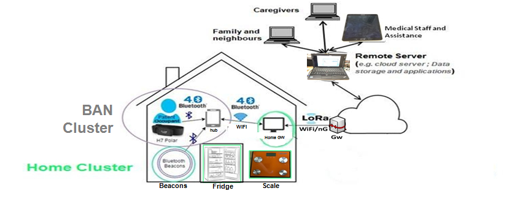

# Example Use Case [Laura Daniele, Marc Girod-Genet, Martin Bauer]
*Describe an example use case that instantiates the problem space, is as simple as possible, but shows the advantages of semantics and can be used in the following subsections.*

In this use case a smart home with smart devices is to be connected to the smart grid. The smart home resident wants to optimize the energy consumption of the house, but still be in control of key aspects, e.g. when the washing has to be done, when the batteries of the electronic vehicle have to be recharged, and that the temperature in the house is kept within a certain range etc. The smart grid company offers the smart home resident a special tariff with significant discounts during times when a surplus of energy is available in exchange for some control on the energy consumption. Thus the smart grid company gets means to balance the overall energy consumption and the smart home resident lowers the energy bill without a significant loss of convenience.

In order to implement the scenario, different systems have to be integrated allowinig the following:
 * connect controllable user devices in the smart home
 * connect the smart grid with the smart home
 * provide the smart home resident with means to define operation policies for the devices
 * provide the smart grid operator with means to define time-dependent energy costs and request an energy-consumption profile
 * optimize energy consumption based on the time-dependent energy costs and the energy-consumption profiles in line with the operation policies and a possible consumption limit

To achieve interoperability between the systems, agreement on the interfaces and the modelling of information is necessary. In this paper we will show how the relevant information can be modelled on a semantic level to achieve semantic interoperability. 

Examples of what needs to be modelled:
 * Device 
   * status
   * control
   * monitoring
   * energy consumption profile
   * operation policy
 * Estimated energy cost timeline
 * Energy consumption limit

The logical component that controls and optimizes the energy consumption in a smart home is called Customer Energy Manager (CEM). The component that collects and analyzes energy consumption is a smart meter.

Let us now consider the additional case where the resident of the house is an elderly that needs support at home, as well as to be continuously monitored (i.e. wellbeing for aging well). In order to implement such use case:
  1.	the resident/elderly needs to be provided with a smart BAN (Body Area Network) for the monitoring and control of its vital    signs, status and activities. This smart BAN mainly comprises, in respect of its resident/elderly embedded device part (smart BAN Cluster), medical/wellbeing sensors, wearables, a BAN coordinator or hub (e.g. a smart-phone, a smart-watch) with in particular data concentrator and network gateway roles. The data concentrator is used for data collection and has also to be provided with embedded data analytics functionalities for local alarm management, local monitoring/control and resident/elderly assistance purposes. The network Gateway is mainly used for data sending to the remote monitoring/control servers and applications located within caregivers or relatives premises. Let us note that, for security/safety reasons, actuations on resident/elderly BAN devices have not been actually considered. 
  2.	this smart BAN has to interact with the Smart Home and some of its appliances mainly for the following purposes: resident/elderly positioning inside the house (e.g. through beacons on the walls), resident/elderly activity tracking, verification of interactions with key appliances (e.g. with a scale for weight measurement, or for verifying if fridge or cooker was used, or if a medication box was opened), resident/elderly comfort management (e.g. maintaining a given temperature/humidity/luminosity level in accordance with resident/elderly condition requirements, as well as with energy efficiency objectives that could be already parameterized for the Smart Home).

The additional use case (i.e. elderly at home monitoring and support) high level architecture is depicted in Figure 1.

In a such environment and use case, it is first mandatory to address security and privacy by design since we are dealing with eHealth and personal safety highly critical data and applications (even if actuations within BANs are not yet considered for quite all the existing use cases). It is also mandatory to address interoperability, in particular since:
1.	At least heterogeneity of medical devices and measures has to be masked at application level,
2.	At the operational level and from the hospital management information system (MIS) point of view, a new patient’ BAN integration into existing monitoring and control systems has to be carried out as far as possible without any redesign of those systems, even partially,
3.	At smart BAN level and from the end user perspective, any new sensor integration has to be transparent for the elderly, with a minimum number of easy operations.

For addressing all the aforementioned requirements, interoperability will have thus to be handled at multiple levels for our elderly at home additional use case:

•	Device level for in particular handling point 3 and to some extend point 2,

•	Informational level, i.e. data and semantic, for in particular

 - handling point 1, point 2, point 3,
 - data/information sharing across systems, i.e. Smart BAN and Smart Home systems,
 - enabling semantic-based embedded data analytics. This will be used here for alarm management, monitoring/control and resident/elderly/caregivers assistance purposes,
 - for facilitating cross-domain interactions, in particular between healthcare, wearables and Smart Home.

•	Network level for mainly handling point 2 and intra/inter systems interoperability.
