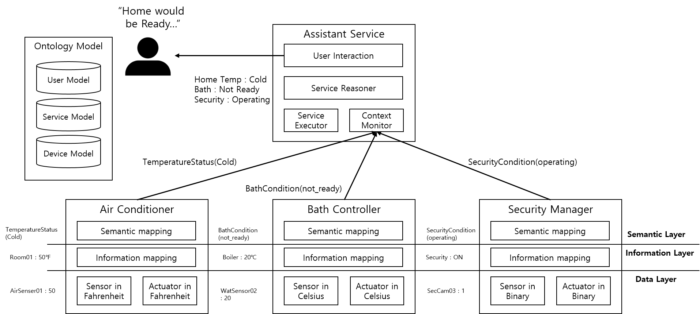
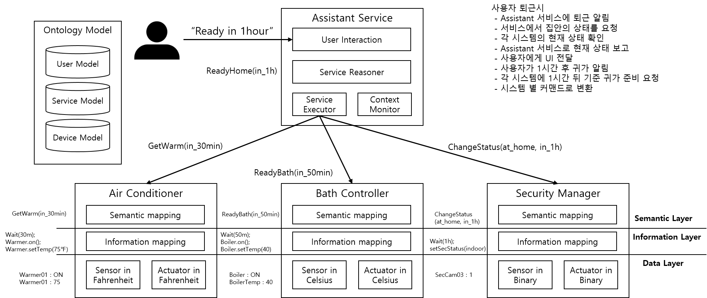

# Semantic Interoperability Across Systems [Antonio Jara]
How to achieve semantic interoperability across systems.

# Semantic interoperability by ontological models [Jaeho Lee]

**1. Request to report**


```java

handleRequest(Request r){	
	OntClass requestService = currentServiceModel.getServiceByName(r.name());
	OntIndiv[] homeControlSystems = currentUserModel.getUserHomeService(requestService);
	for(OntIndiv system : homeConstrolSystem){
		String service = system.getServiceName();
		String arg = system.getServiceArgument(r.getArgument);
		systemConnector.set(service,arg);
	}
}

```

**2. Status Report**


**3. Request to control**


